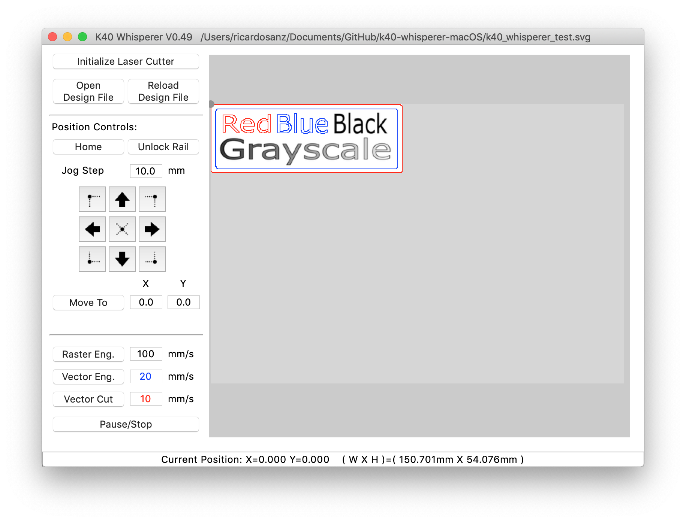

# Archived repo

I no longer own a K40, so I can't test and properly mantain this build. This repository is just an archive of previous builds.

# K40 Whisperer for macOS

Packaging of Scorchworks K40 Whisperer as a macOS Application. In this repo you can find the necessary files to build K40 Whisperer for macOS. The files regarding Linux and Windows systems have been removed.

> K40 Whisperer is an alternative to the the Laser Draw (LaserDRW) program that comes with the cheap Chinese laser cutters available on E-Bay and Amazon. K40 Whisperer reads SVG and DXF files,interprets the data and sends commands to the K40 controller to move the laser head and control the laser accordingly. K40 Whisperer does not require a USB key (dongle) to function.



The official K40 Whisperer and instructions are at Scorchworks:

> http://www.scorchworks.com/K40whisperer/k40whisperer.html

This fork is to add packaging and minor fixes to work on macOS systems, creating a clickable application that can be installed on any macOS system. This eliminates having to run K40 Whisperer from a Terminal prompt.

## Running The Packaged Application

[Download](https://github.com/rsre/k40-whisperer-macOS/releases) the latest macOS package.

K40 Whisperer requires a few dependencies that are not installed as part of the application bundle. You will need to install these yourself to have a functioning application.

* [Homebrew](https://brew.sh/) Not required but **strongly recomended**
* [libusb](https://libusb.info) for access to the USB port(s)
* [inkscape](https://inkscape.org) for drawing and rasterization

These dependencies are best installed with [Homebrew](https://brew.sh/) in a `Terminal` window as follows. This only needs to be done once on your system.

Install HomeBrew (only if you don't have it):
```sh
/bin/bash -c "$(curl -fsSL https://raw.githubusercontent.com/Homebrew/install/master/install.sh)"
```
Install Dependencies from Brewfile:
```sh
brew bundle install
```

You need not read any further in this document. You should be able to run K40 Whisperer.

## Rebuilding from Source (macOS)

In the main directory run `build_macOS.sh`. This will create a clickable macOS Application in the `./dist` directory named `K40 Whisperer.app` that can then be distributed or moved to your Applications folder. See the following sections for details based on your chosen Python version.

## macOS Build Notes

This fork adds the following files to Scorch's work

* `build_macOS.sh` -- bash build script to build and create application bundle.
* `emblem.icns` -- Icons for macOS application bundle

When a new source package is released by Scorch, the general update process is:
1. Download and extract the new source code
2. Merge the new changes into this repo
3. Run `build_macOS.sh`
4. Test the new version
5. Upload to GitHub
